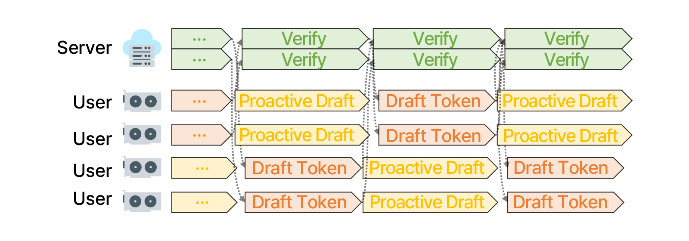
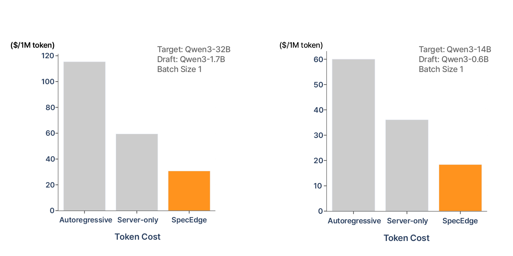
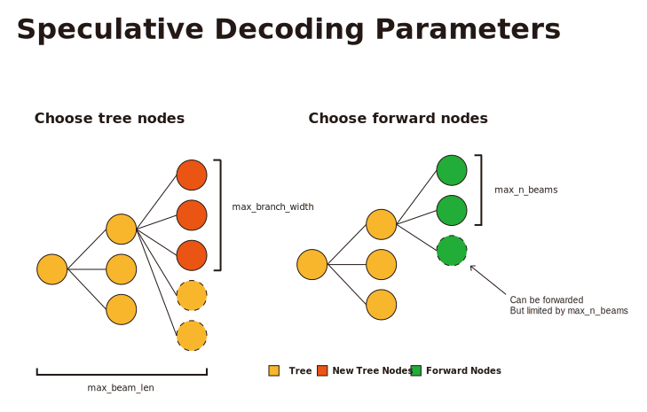

# SpecEdge \[NeurIPS 2025\]

> Scalable Edge-Assisted Serving Framework for Interactive LLMs

[paper](https://arxiv.org/abs/2505.17052)

SpecEdge is an edge-assisted LLM inference framework that leverages consumer-grade GPUs for cost-effective serving at scale. By splitting workloads between edge and server using speculative decoding, SpecEdge achieves 2.22x server throughput and 11.24% lower latency compared to server-only baselines. The framework features proactive edge drafting and pipeline-aware scheduling to maximize resource utilization and serving efficiency.





## Experimental Setup

Our experiments were conducted with the following hardware:

### Server (A100 40GB)

- GCP a2-highgpu-1g
- Ubuntu 24.04 LTS NVIDIA version: 580

### Server (A100 80GB)

- GCP a2-ultragpu-1g
- Ubuntu 24.04 LTS NVIDIA version: 580

### Edge

- Ubuntu 20.04.6 LTS (Focal Fossa)
- Two Intel(R) Xeon(R) Silver 4210R CPU @ 2.40GHz
- 208GiB Memory
- 10GbE network interface

## Setup

```bash
git clone https://github.com/kaist-ina/specedge
cd specedge
uv sync
```

## SpecEdge

### Usage

Before running, ensure that SSH communication is established between the node executing the `client_host.sh` script and other edge nodes. Additionally, the SpecEdge repository must be cloned to identical absolute paths across all edge nodes (e.g., all nodes should have the repository at `/home/user/specedge`).

```bash
# server
./script/batch_server.sh -f config/specedge.example.yaml

# edge
./script/client_host.sh -f config/specedge.example.yaml
```

### Configuration

The `specedge.example.yaml` configuration file contains the following settings:

**Base Settings:**

- `result_path`: Base directory where experiment results are saved
- `exp_name`: Experiment name for folder name and identification
- `dtype`: Model precision (fp16/fp32)
- `seed`: Random seed for reproducibility
- `ssh_key`: SSH key path for remote server access
- `max_len`: Maximum sequence length (max KV Cache length)

**Server Settings:**

- `process_name`: Server process identifier for logging
- `target_model`: HuggingFace model path (e.g., Qwen/Qwen3-14B)
- `device`: CUDA device identifier for the server target model (e.g., cuda:0)
- `temperature`: Sampling temperature for generation
- `max_batch_size`: Maximum batch size for concurrent requests
- `num_clients`: Expected number of concurrent edge clients, must match the number of edge clients
- `batch_type`: Batching strategy (static/dynamic)
- `cache_prefill`: Enable prefill KV cache preloading
  - `true`: Pre-compute and cache all dataset prompts at server startup for benchmark experiments
  - `false`: Perform prefill at runtime using client-provided prompts

**Client Settings:**

- `host`: Server endpoint (e.g., 127.0.0.1:8000)
- `process_name`: Client process identifier for logging
- `draft_model`: HuggingFace model path for draft generation (e.g., Qwen/Qwen3-1.7B)
- `dataset`: Benchmark dataset name (c4, mtbench, oasst, wikitext and specbench)
- `sample_req_cnt`: Sampling frequency of requests from dataset
- `reasoning`: Enable reasoning
- `req_offset`: Offset for request sampling
- `max_n_beams`, `max_beam_len`, `max_branch_width`, `max_budget`: Speculative decoding parameters
- `proactive`: Proactive edge drafting configuration
  - `type`: Proactive drafting mode (excluded/included)
  - `max_n_beams`, `max_beam_len`, `max_branch_width`, `max_budget`: Proactive drafting parameters
- `max_new_tokens`: Maximum tokens to generate per request
- `max_request_num`: Total requests to process (-1 for all)

**Node Settings:**

- `node-name`: Name of each edge node for SSH access (must match the SSH hostname configured in your SSH config or be a resolvable hostname)
  - `device`: CUDA device identifier for the edge process on this node (e.g., cuda:0, cuda:1)

### Metrics

Before running the metric script, you need to collect the JSONL files from both the server and edge into a single location.

```bash
. .venv/bin/activate
python src/metric/specedge.py -d result/demo/specedge --gpu "A100-40" # A100 40GB
python src/metric/specedge.py -d result/demo/specedge --gpu "A100-80" # A100 80GB
```

## Auto Batch

### Usage

```bash
./script/auto_batch.sh -f config/auto_batch.example.yaml
```

### Configuration

The `auto_batch.example.yaml` configuration file contains the following settings:

**Base Settings:**

- `result_path`: Base directory where experiment results are saved
- `exp_name`: Experiment name for folder name and identification
- `seed`: Random seed for reproducibility
- `model`: HuggingFace model path (e.g., Qwen/Qwen3-14B)
- `device`: CUDA device identifier for the model (e.g., cuda:0)
- `dtype`: Model precision (fp16/fp32)
- `temperature`: Sampling temperature for generation
- `dataset`: Benchmark dataset name (c4, mtbench, oasst, wikitext and specbench)
- `batch_size`: Batch size for concurrent request processing
- `max_len`: Maximum sequence length (max KV Cache length)
- `max_new_tokens`: Maximum tokens to generate per request
- `max_request_num`: Total requests to process (-1 for all)
- `sample_req_cnt`: Number of sample requests from dataset

### Get metrics

```bash
. .venv/bin/activate
python src/metric/auto_batch.py -d result/demo/auto_batch --gpu "A100-40" # A100 40GB
python src/metric/auto_batch.py -d result/demo/auto_batch --gpu "A100-80" # A100 80GB
```

## Server-Only

### Usage

```bash
./script/server_only.sh -f config/server_only.example.yaml
```

### Configuration

The `server_only.example.yaml` configuration file contains the following settings:

**Base Settings:**

- `result_path`: Base directory where experiment results are saved
- `exp_name`: Experiment name for folder name and identification
- `dtype`: Model precision (fp16/fp32)
- `seed`: Random seed for reproducibility
- `ssh_key`: SSH key path for remote server access (not required for server_only)
- `max_len`: Maximum sequence length (max KV Cache length)

**Server Settings:**

- `process_name`: Server process identifier for logging
- `target_model`: HuggingFace model path (e.g., Qwen/Qwen3-14B)
- `device`: CUDA device identifier for the server target model (e.g., cuda:0)
- `temperature`: Sampling temperature for generation
- `num_clients`: Expected number of concurrent clients

**Client Settings:**

- `host`: Server endpoint (not required for server_only)
- `process_name`: Client process identifier for logging
- `draft_model`: HuggingFace model path (e.g., Qwen/Qwen3-1.7B)
- `dataset`: Benchmark dataset name (c4, mtbench, oasst, wikitext and specbench)
- `max_n_beams`, `max_beam_len`, `max_branch_width`, `max_budget`: Speculative decoding parameters
- `max_batch_size`: Maximum batch size for requests
- `max_new_tokens`: Maximum tokens to generate per request
- `max_request_num`: Total requests to process (-1 for all)
- `sample_req_cnt`: Number of sample requests from dataset
- `device`: CUDA device identifier for the client draft model (e.g., cuda:0)

### Get metrics

```bash
. .venv/bin/activate
python src/metric/server_only.py -d result/demo/server_only --gpu "A100-40" # A100 40GB
python src/metric/server_only.py -d result/demo/server_only --gpu "A100-80" # A100 80GB
```

## Speculative Decoding Parameters



SpecEdge uses a tree-based speculative decoding approach to generate multiple candidate tokens efficiently. The following parameters control the structure and size of the speculation tree:

- `max_n_beams`: Maximum number of nodes that can be forwarded through the model in a single iteration. This parameter limits how many tree nodes are selected as candidates for the forward pass. Even if more nodes could potentially be forwarded based on their probabilities, only the top `max_n_beams` nodes are processed to control computational cost.
- `max_beam_len`: Maximum depth of the speculation tree, representing how many sequential token generation steps are performed during one draft phase. The tree grows iteratively for `max_beam_len` steps, with each step expanding the tree by forwarding selected candidate nodes.
- `max_branch_width`: Maximum number of child tokens generated from each parent node in the tree. When processing logits from a forward pass, up to `max_branch_width` tokens with the highest probabilities are selected as potential continuations from each node.
- `max_budget`: Maximum total number of nodes allowed in the speculation tree (excluding the prefix). This parameter controls the overall tree size by pruning nodes with lower probabilities. After tree construction, if the number of nodes exceeds `max_budget`, only the top `max_budget` nodes based on cumulative log probabilities are retained. The budget mechanism uses a priority-based filtering approach with a decay factor (0.9) applied to parent node scores.

This speculative decoding approach is based on the SpecExec algorithm. For more details, please refer to the [SpecExec paper](https://github.com/yandex-research/specexec).

## Citation

```
@inproceedings{park2025specedge,
  author = {Jinwoo Park and Seunggeun Cho and Dongsu Han},
  title = {SpecEdge: Scalable Edge-Assisted Serving Framework for Interactive LLMs},
  booktitle = {Annual Conference on Neural Information Processing Systems},
  year = {2025},
  eprint = {2505.17052},
  archivePrefix = {arXiv},
  primaryClass= {cs.CL}
}
```
